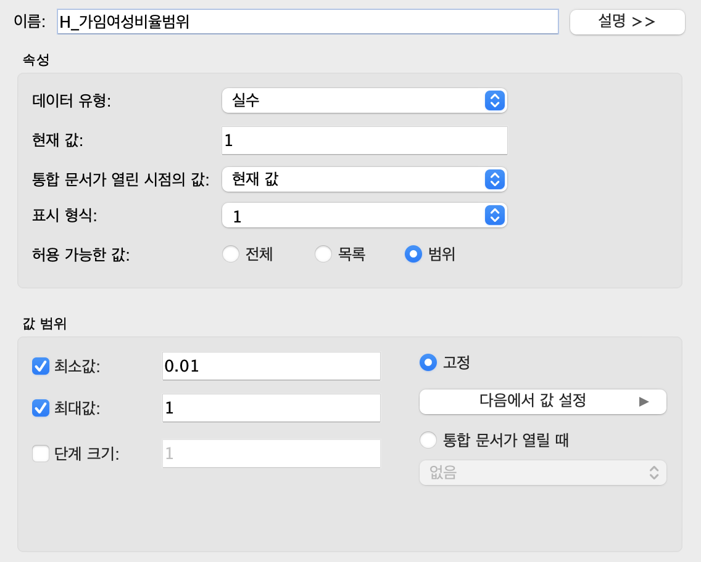

---

layout: single
title:  "[Tableau] 도시소멸지수 구하기-(2)"

---


## 1. 도시소멸지수 등급화

💡 **LOD함수**

- {FIXED [차원] : 집계식([측정값])}
- {INCLUDE [차원] : 집계식([측정값])}
- {EXCLUDE [차원] : 집계식([측정값])}

```sql
# 시도명, 시군구명, 읍면동명, 리명 모두 fixed 해줌
{FIXED [시도명],[시군구명],[읍면동명],[리명]: [도시소멸지수]}

# 중복된 주소를 방지하기위해 주소를 합쳐줌 
[시도명]+[시군구명]+[읍면동명]+[리명]

# 5등급으로 나누기 (임의로 나눴음)
IF [Fixed_도시소멸지수] < 0.1 then '5등급'
ELSEIF [Fixed_도시소멸지수] <0.3 then '4등급'
ELSEIF [Fixed_도시소멸지수] <0.8 THEN '3등급'
ELSEIF [Fixed_도시소멸지수] <1.5 then '2등급'
ELSE  '1등급'
END
```

- 도시소멸지수가 낮을 수록 소멸위험지역이 높음 ⇒ 가임여성비율이 낮고, 고령자 비율이 높음


## 2. 가임여성 비율범위 매개변수 만들기

- 가임여성비율의 범위가 0.01부터 1.00이니까 데이터 유형을 실수로 하고 최소값0.01 최대값 1.00으로 설정



```sql
# 도시소멸지수에 설정한 매개변수값 곱하기 
SUM([가임여성수])/SUM([고령자수])*[H_가임여성비율범위]
```

- 도시소멸지수에 가임여성비율 값을 곱하여 파라미터 조정하기


* 도시소멸지수

  - 매개변수가 0.01인 경우 도시소멸지수는 0.006890

  - 매개변수가 0.5인 경우 도시소멸지수는 0.3505

  - 매개변수가 1인경우 도시소멸지수는 0.6890

**⇒ 매개변수가 클수록 도시소멸지수는 높아짐을 알 수 있다.**

**⇒ 매개변수가 낮을수록 도시소멸지수는 낮아져 소멸위험지역이 높아진다.**


## 3. 고령자 비율범위 매개변수 만들기

- 고령자 비율 범위가 65세부터 100세까지니까  데이터 유형은 정수로 맞춰주고 최소값은 65 최대값은 100으로 설정


```sql
# 도시소멸지수에 설정한 매개변수값 곱하기 
SUM([가임여성수])/SUM([고령자수])*[H_고령자비율범위]
```

- 도시소멸지수에 고령자비율을 곱하여 파라미터 조정하기


- 고령자비율범위 * 도시소멸지수
  - 매개변수가 65인 경우 도시소멸지수는 44.79
  - 매개변수가 85인 경우 도시소멸지수는 58.57
  - 매개변수가 100인경우 도시소멸지수는 68.90

```sql
#F_도시소멸지수
{FIXED : [C_도시소멸지수]}
#F_도시소멸지수(시도명)
{FIXED [시도명]: [C_도시소멸지수]}
#F_도시소멸지수(시군구)
{FIXED [시도명] ,[시군구명]: [C_도시소멸지수]}
#F_도시소멸지수(읍면동)
{FIXED [시도명] ,[시군구명],[읍면동명]: [C_도시소멸지수]}
#F_도시소멸지수(리) 
{FIXED [시도명] ,[시군구명],[읍면동명],[리명]: [C_도시소멸지수]}
```


- 도시소멸지수 평균은 0.689로 시도명/시도군/읍면동/리 로 구분하여 살펴봄
- 도시소멸지수 평균 이하는 소멸위험지역으로 나타나고 이상은 정상지역으로 구분할 수 있음
- 시도명/시군구/읍면동/리 모두 소멸위험지역인 지역은 강원도, 경상남도, 경상북도,부산광역시, 전라남도, 전라북도, 제주도, 충청남도, 충청북도 총 9개 지역으로 나타남
- 정상위험지역은 경기도, 광주광역시, 대구광역시, 대전광역시, 서울특별시, 세종특별자치시, 울산광역시, 인천광역시 총 7개 지역으로 대도시권으로 나타남


## 4. 읍면동 검색기능


- 검색FLAG 만들기
- 광주광역시 광산구 장덕동 검색 결과 모든 도시소멸지수 평균값이 0.5이상으로 나타나 정상지역임


- 전라남도 나주시 산포면 검색 결과 모든 도시소멸지수 평균값이 0.5이하로 소멸위험지역으로 구분됨 


## 5. 대시보드화면


