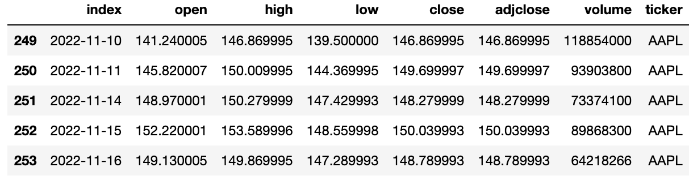
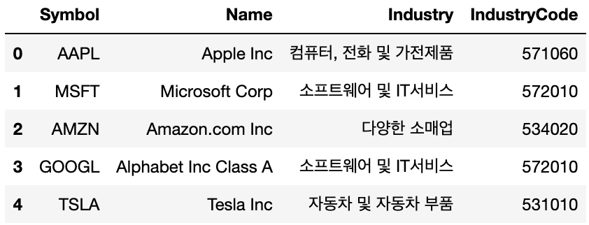
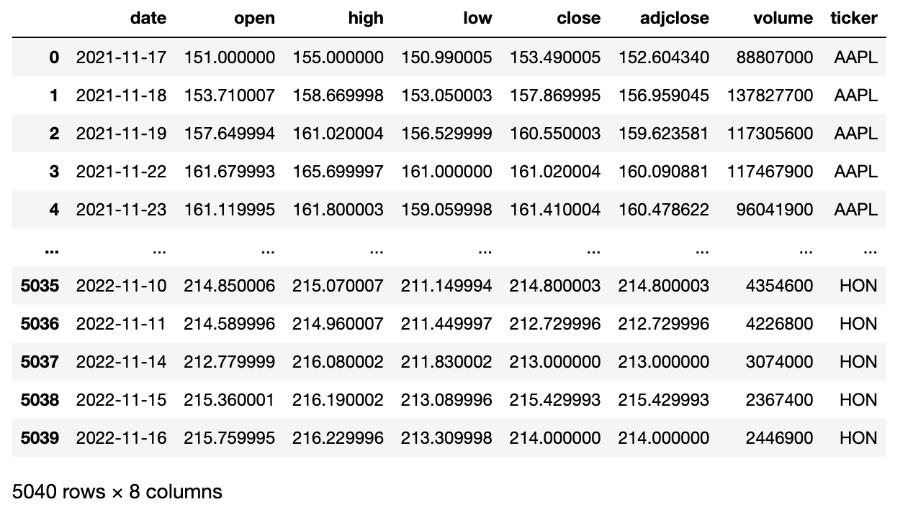
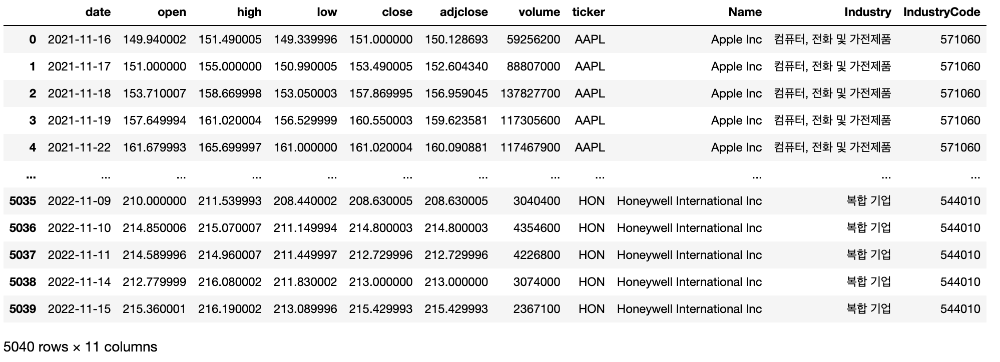

# 1. 데이터 수집

## 1.1 활용 라이브러리

- yfinance는 야후 파이낸스에서 크롤링한 데이터를 제공하는 라이브러리이다.

[야후파이낸스](https://finance.yahoo.com/quote/AAPL/history?period1=1637071521&period2=1668607521&interval=1d&filter=history&frequency=1d&includeAdjustedClose=true)

```python
#!pip install yahoo-fin
import yahoo_fin.stock_info as si   #주가정보조회
import FinanceDataReader as fdr  #산업정보조회
import pandas as pd
import datetime
```

- yfinace라이브러리를 사용할 수 있지만 si 라이브러리는 ticker까지 한번에 추출가능하여 si라이브러리 사용
- 미국주가데이터는 다우, 나스닥, S&P 500, 그 외 종목이 있으나 이번 데이터는 나스닥 데이터만 수집함

## 1.2 나스닥 수집 데이터

### - 주가정보 데이터

```python
# 예시) 애플 주가 정보
AAPL = si.get_data('AAPL', start_date = '2021-11-15', interval="1d").reset_index() #1d:하루간격, 1mon:한달간격
AAPL.tail(5)
```



| 구분 | 칼럼명 | 설명 | 비고 |
| :-: | :-: | :-: | :-: |
| 1 | index | 날짜 | datetime64[ns] |
| 2 | open | 시가 | float64 |
| 3 | high | 고가 | float64 |
| 4 | low | 저가 | float64 |
| 5 | close | 종가 | float64 |
| 6 | adjclose | 수정종가 | float64 |
| 7 | volume | 거래량 | int64 |
| 8 | ticker | 종목 | object |

### - 산업정보 데이터

```python
df_nasdaq = fdr.StockListing('NASDAQ') #나스닥산업정보 
df_nasdaq.head()
```



| 구분 | 칼럼명 | 설명 | 비고 |
| :-: | :-: | :-: | :-: |
| 1 | Symbol | 종목 | object |
| 2 | Name | 회사명 | object |
| 3 | Industry | 산업 | object |
| 4 | IndustryCode | 산업코드 | object |


# 2. 데이터 전처리

## 2.1 상위 20개만 추출

```python
df_nasdaq = df_nasdaq.iloc[0:20, :] #상위20개만 추출
df_stock_list = df_stock['Symbol'].unique() 
df_stock_list
```

.png)

## 2.2 컬럼명 변경

- Symbol을 ticker로 컬럼명을 일치시킴 >> 추후 merge할때 편함

```python
df_stock = df_stock.rename(columns={'Symbol':'ticker'})
df_stock
```


## 2.3 현재날짜를 기준으로 1년전 데이터 추출

```python
from datetime import datetime
from datetime import timedelta
from dateutil.relativedelta import relativedelta

now = datetime.now()
before_one_year = now + relativedelta(years=-1)
before_one_year = before_one_year.strftime('%Y-%m-%d')
```


## 2.4 상위 20개 기업의 1년동안 주가 정보 추출

```python
stock_list = [] #주가정보

for i in df_stock_list: 
    nasdaq = si.get_data(str(i),start_date = before_one_year, interval='1d') #주가정보
    stock_list.append(nasdaq)

stock_list = pd.concat(stock_list) #stock_list는 리스트형식으로 DataFrame으로 변환 시 concat해줌
```

```python
stock_list = stock_list.rename(columns={'index':'date'}) #stock_list index를 date로 컬럼명 변경 
stock_list
```



## 2.5 데이터 합치기 (merge)

```python
yfinance = pd.merge(stock_list,df_stock, on='ticker') #중복컬럼인 ticker를 기준으로 합치기
yfinance
```



| 구분 | 칼럼명 | 설명 | 비고 |
| :-: | :-: | :-: | :-: |
| 1 | date | 날짜 | datetime64[ns] |
| 2 | open | 시가 | float64 |
| 3 | high | 고가 | float64 |
| 4 | low | 저가 | float64 |
| 5 | close | 종가 | float64 |
| 6 | adjclose | 수정종가 | float64 |
| 7 | volume | 거래량 | int64 |
| 8 | ticker | 종목 | object |
| 9 | Name | 회사명 | object |
| 10 | Industry | 산업 | object |
| 11 | IndustryCode | 산업코드 | object |

## 2.6 데이터 저장

```python
yfinance.to_csv('./나스닥주가데이터20개.csv',encoding='euc-kr')
```

