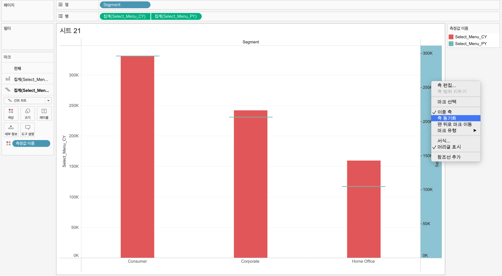
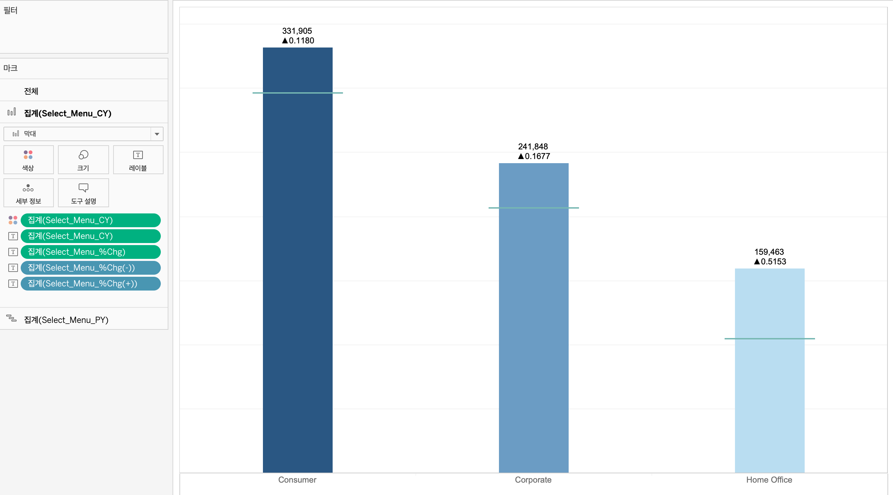

---

<I>태블로 샘플데이터인 SuperStore 데이터로 대시보드 설계해보기!</I>

---

☑️ **요구사항**

- 년도별로 데이터 변경할 수 있게 해주세요! 
- Sales, Profit, Orders 클릭 시 해당 데이터로 조회할 수 있게 해주세요! 
- State, Segment, Manufacturers, Category, Sub-Category, Customers 정보를 보여주세요!

### 사용된 차원 및 측정값

| 구분 | 칼럼명        | 설명         | 비고 |
| :--- | ------------- | ------------ | ---- |
| 1    | Customer Name | 고객명       |      |
| 2    | State         | 지역         |      |
| 3    | Order Date    | 주문날짜     |      |
| 4    | Order ID      | 주문번호     |      |
| 5    | Category      | 카테고리     |      |
| 6    | Sub-Category  | 세부카테고리 |      |
| 7    | Manufacturer  | 제조사       |      |
| 8    | Segment       | 고객구분     |      |
| 9    | Profit        | 이율         |      |
| 10   | Sales         | 판매수       |      |
| 11   | Orders        | 고객수       |      |

---

# 1. 레이아웃 생성

---

# 2. 매개변수 생성

- 년도별로 데이터를 조회하기 위해 Year 매개변수 생성
- Sales, Profit, Orders 클릭 시 해당 데이터로 조회할 수 있도록 P_menu 매개변수 생성

---

# 3. 년도별 데이터 조회

> 해당 대시보드는 세로 레이아웃 안에 가로 레이아웃을 두고 3개의 시트로 구성하였다.

- 1번 시트 : Year매개변수를 변동시킬때 해당하는 년도의 **판매량**을 보여줌 
- 2번 시트 : 해당년도의 판매량과 직전년도의 판매량을 비교한 **전년대비 성장률**을 보여줌 
- 3번 시트 : 해당년도의 **월별 판매량**을 보여줌

## 3.1 SALES

| 계산된 필드    | 필드명         | 식                                                           |
| -------------- | -------------- | ------------------------------------------------------------ |
| Sales CY       | 현재년도       | IF DATEPART('year', [Order Date])=[매개 변수].[Year] THEN [Sales] END |
| Sales PY       | 직전년도       | IF DATEPART('year', [Order Date])=([매개 변수].[Year])-1 THEN [Sales] END |
| %Chg_Sales     | 전년대비성장률 | (SUM([Sales CY])-SUM([Sales PY]))/SUM([Sales PY])            |
| %Chg_Sales (+) | 증가표시       | IF [%Chg_Sales] > 0 THEN "▲" END                             |
| %Chg_Sales (-) | 감소표시       | IF [%Chg_Sales] < 0 THEN "▼" END                             |

## 3.2 PROFIT

| 계산된 필드     | 필드명         | 식                                                           |
| --------------- | -------------- | ------------------------------------------------------------ |
| Profit CY       | 현재년도       | IF DATEPART('year', [Order Date])=[매개 변수].[Year] THEN [Profit] END |
| Profit PY       | 직전년도       | IF DATEPART('year', [Order Date])=([매개 변수].[Year])-1 THEN [Profit] END |
| %Chg_Profit     | 전년대비성장률 | (SUM([Profit CY])-SUM([Profit PY]))/SUM([Profit PY])         |
| %Chg_Profit (+) | 증가표시       | IF [%Chg_Profit] > 0 THEN "▲" END                            |
| %Chg_Profit (-) | 감소표시       | IF [%Chg_Profit] < 0 THEN "▼" END                            |

## 3.3 ORDERS

| 계산된 된 필드  | 필드명         | 식                                                           |
| --------------- | -------------- | ------------------------------------------------------------ |
| Orders CY       | 현재년도       | IIF DATEPART('year', [Order Date])=[매개 변수].[Year] THEN [Order ID] END |
| Orders PY       | 직전년도       | IIF DATEPART('year', [Order Date])=([매개 변수].[Year])-1 THEN [Order ID] END |
| %Chg_Orders     | 전년대비성장률 | (COUNTD([Orders CY])-COUNTD([Orders PY])) /COUNTD([Orders PY]) |
| %Chg_Orders (+) | 증가표시       | IF [%Chg_Orders] > 0 THEN "▲" END                            |
| %Chg_Orders (-) | 감소표시       | IF [%Chg_Orders] < 0 THEN "▼" END                            |

## 3.4 CUSTOMERS

| 계산된 필드       | 필드명         | 식                                                           |
| ----------------- | -------------- | ------------------------------------------------------------ |
| Customers CY      | 현재년도       | IIF DATEPART('year', [Order Date])=[매개 변수].[Year] THEN  [Customer Name] END |
| Customers PY      | 직전년도       | IIF DATEPART('year', [Order Date])=([매개 변수].[Year])-1 THEN [Customer Name] END |
| %Chg_Customers    | 전년대비성장률 | (COUNTD([Customers CY])-COUNTD([Customers PY])) /COUNTD([Customers PY]) |
| %Chg_Customers(+) | 증가표시       | IF [%Chg_Customers] > 0 THEN "▲" END                         |
| %Chg_Customers(-) | 감소표시       | IF [%Chg_Customers] < 0 THEN "▼" END                         |

---

# 4. 선택 메뉴별 데이터 조회

## 	4.1 메뉴버튼 시트만들기

  1. 3개의 열을 생성하여 마크를 ‘모양’으로 변경해준다.

  2. 원하는 모양을 선정하여 ‘내 Tableau 리포지토리/모양/사용자지정’ 경로에 넣어주어 모양을 변경시켜준다.

  3. 메뉴 클릭 시 색이 변경되도록 필드를 생성해주고, 메뉴에 텍스트를 넣어주기 위해 텍스트 필드를 생성해준다.

     | 계산된 필드   | 필드명        | 식                |
     | ------------- | ------------- | ----------------- |
     | Metric_Sales  | Sales T/F     | [P_menu]="Sales”  |
     | Metric_Profit | Profit T/F    | [P_menu]="Profit” |
     | Metric_Orders | Orders T/F    | [P_menu]="Orders” |
     | “Sales”       | Sales 텍스트  | “Sales”           |
     | “Profit”      | Profit 텍스트 | “Profit”          |
     | “Orders”      | Orders 텍스트 | “Orders”          |

4. P_menu 매개변수를 표시하여 버튼 클릭 시 색이 변경된 것을 확인 할 수 있다. 		

## 4.2 메뉴버튼 클릭 시 해당 데이터 조회

> **CASE 함수** 를 써서 해당 데이터 클릭 시 해당 데이터로 조회가능하게 만들어줌

| 계산된 필드         | 필드명                | 식                                                           |
| ------------------- | --------------------- | ------------------------------------------------------------ |
| Select_Menu_CY      | 현재년도 메뉴선택     | CASE [P_menu] WHEN "Sales" THEN SUM([Sales CY]) WHEN "Profit" THEN SUM([Profit CY]) WHEN "Orders" THEN COUNTD([Orders CY]) END |
| Select_Menu_PY      | 직전년도 메뉴선택     | CASE [P_menu] WHEN "Sales" THEN SUM([Sales PY]) WHEN "Profit" THEN SUM([Profit PY]) WHEN "Orders" THEN COUNTD([Orders PY]) END |
| Select_Menu_%Chg    | 메뉴별 전년대비성장률 | CASE [P_menu] WHEN "Sales" THEN [%Chg_Sales] WHEN "Profit" THEN [%Chg_Profit] WHEN "Orders" THEN [%Chg_Orders] END |
| Select_Menu_%Chg(+) | 메뉴별 증가현황       | CASE [P_menu] WHEN "Sales" THEN [%Chg_Sales (+)] WHEN "Profit" THEN [%Chg_Profit (+)] WHEN "Orders" THEN [%Chg_Orders (+)] END |
| Select_Menu_%Chg(-) | 메뉴별 감소현황       | CASE [P_menu] WHEN "Sales" THEN [%Chg_Sales (-)] WHEN "Profit" THEN [%Chg_Profit (-)] WHEN "Orders" THEN [%Chg_Orders (-)] END |

---

# 5. 그래프 시트 만들기

## 5.1 State

> 위 그래프는 State별로 집계를 색상과 크기로 동시에 보여주었다. 이는 **이중축**을 사용하면 된다!

1. 우리는 두가지 그래프를 표현해야하기 때문에 행에 ‘위도’ , 열에 ‘경도’ 2개를 두어 이를 이중축 해준다. 
2. 마크를 보면 첫번째 경도는 맵으로 변경해주고 두번째 경도는 원으로 변경해주면 그림과 같은 지도가 나타나진다. 

3. Select_Menu_CY 컬럼을 첫번째 경도에는 색상, 두번째 경도에는 크기에 두어 State별로 집계를 나타낼 수 있다. 

4. 원하는 색상으로 변경하고, 매개변수를 표시하여 매개변수를 선택하면 데이터가 바뀌는 것을  확인할 수 있다. 

## 5.2 Segment

> 위 그래프는 Segment별로 구분하여 현재년도는 막대그래프, 직전년도는 간트차트로 표현하였다. 이는 **이중축**을 사용하면 된다! 

1. 우리는 두가지 그래프를 표현해야하기 때문에 행에 ‘segment’ , 열에 ‘Select_Menu_CY’, ‘Select_Menu_PY’ 를 두어 이중축 해준다.
2. 마크를 보면 ‘Select_Menu_CY’는 막대그래프로 변경해주고 ‘Select_Menu_PY’는 간트차트로 변경해주면 그림과 같은 그래프가 나타나지고 이를 **축동기화** 시켜준다!

3. ‘Select_Menu_CY’ 집계별로 색상을 다르게 나타내주고, 현재년도의 집계값과 전년대비성장률, 증감표시까지 레이블에 나타나주었다. 

4. 데이터 값을 보기 좋게 수정하기 위해 ‘Select_Menu_CY’와 ‘Select_Menu_%Chg’ 서식을 변경해주었다.

   - 일반서식으로 사용해도 되나, orders는 기준값이 다르기 때문에 계산식을 사용하여 표현해줌 → 추후 그래프는 Select_Menu_CY(Label)컬럼 사용)

   - 제목도 매개변수로 변경하여 매개변수가 바뀔때 제목도 같이 바뀌는 것을 볼 수 있다. (제목편집→ 삽입 → 매개변수 클릭)

     | 계산된 필드           | 식                                                           |
     | --------------------- | ------------------------------------------------------------ |
     | Select_Menu_CY(Label) | CASE [P_menu] WHEN "Sales" THEN "$" +STR(ROUND((SUM([Sales CY])/1000),1))+"K" WHEN "Profit" THEN "$" +STR(ROUND((SUM([Profit CY])/1000),1))+"K" WHEN "Orders" THEN STR(COUNTD([Orders CY])) END |

     

# 5.3 Manufactures

> 위 그래프는 선택된 년도에서 상위10개의 manufactures를 랭킹별로 보여주는 그래프이다. 

1. 열에 ‘Select_Menu_CY’, 행에 ‘Manufactuer’을 두고 내림차순으로 정렬하였다.

2. 상위 10개만 표시해야하므로 계산식을 만들어 필터에 적용해주었다.

   | 계산된 필드      | 필드명           | 식                                                           |
   | ---------------- | ---------------- | ------------------------------------------------------------ |
   | Select_Menu_Rank | 선택된 메뉴 순위 | CASE [P_menu] WHEN "Sales" THEN RANK_UNIQUE(SUM([Sales CY])) WHEN "Profit" THEN RANK_UNIQUE(SUM([Profit CY])) WHEN  "Orders" THEN RANK_UNIQUE(COUNTD([Orders CY])) END |

   

3. ‘Select_Menu_CY’ 집계별로 색상을 다르게 나타내주고 순위, 집계값, manufacture정보를 보여주었다. 

## 5.4 Category  (=Segment와 동일)

## 5.5 Sub-Category (=Segment와 동일)

## 5.6 Customers (=Manufactures 와 동일)

# ✅ 완성 대시보드

